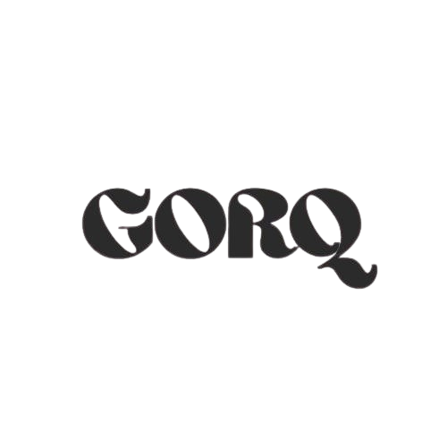

<!--
  README for Gorq PRIME Series
  Place logo images at:
    - assets/gorq-logo.png       (Gorq master logo)
    - assets/prime-logo.png      (PRIME series mark / logo)
-->

  
  

<h1 align="center">Gorq PRIME — A Series for Inclusive, Responsible AI</h1>

  <strong>Gorq PRIME</strong> is a coordinated model & research series from <a href="https://gorqai.digital" target="_blank" rel="noopener">Gorq AI Platforms</a>, designed to advance practical, accessible, and ethical AI. This repository documents the PRIME series: goals, research principles, collaboration pathways, and progress — rather than providing or redistributing model weights.  

---

## Quick links
- Official Gorq website: [https://gorqai.digital](https://gorqai.digital)  
- PRIME series official page: <!-- EDIT: replace with the canonical PRIME page URL if different --> [https://gorqai.digital/products/prime-series](https://gorqai.digital/products/prime-series)
- GitHub — Gorq organization: [https://github.com/Gorq-AI-Platforms](https://github.com/Gorq-AI-Platforms)  
- PRIME-1 repository (GitHub): <!-- EDIT: replace if your repo path differs --> [https://github.com/Gorq-AI-Platforms/gorqprime-1](https://github.com/Gorq-AI-Platforms/gorqprime-1)  
- Hugging Face org: [https://huggingface.co/Gorq-AI-Platforms](https://huggingface.co/Gorq-AI-Platforms)

---

## About the PRIME series
Gorq PRIME is a planned series of models, tools and companion systems intended to accelerate responsible AI adoption for public benefit. The series will target:

- **General-purpose assistance & automation** — task planning, coding assistance, and workflow automation with safe defaults.  
- **Multilingual & local-first capabilities** — prioritizing language coverage for underserved regions.  
- **Research-first design** — combining applied research and engineering to produce reliable, auditable behaviors.  
- **Open collaboration and inclusion** — community contributions, third-party audits, and transparent model cards.

> The PRIME series is an ongoing initiative — work, experiments and releases will be published progressively under the Gorq umbrella. This repo collects documentation, design notes and contribution guidance for the series.

---

## Rebuild Initiative & Why PRIME
In 2025 Gorq committed to a Rebuild Initiative to recover from infrastructure setbacks and to reimagine the project with stronger, more resilient systems and community governance. PRIME is the strategic outcome of that initiative: a modular model series and platform architecture intended to be maintainable, auditable and accessible.

Key objectives of the Rebuild Initiative:
- Reconstruct model development and data pipelines with fault-tolerant storage and backup.  
- Improve reproducibility and traceability of training data and experiments.  
- Emphasize low-cost / donation-backed access tiers so research and tools remain accessible.  
- Build tooling for responsible release: documentation, model cards, bias testing and red-teamning.

---

## Research & System Design Principles
Gorq PRIME follows these guiding principles in research and engineering:

- **Safety first** — safety reviews, evaluation harnesses and mitigations integrated into every release cycle.  
- **Modularity** — models, adapters, instruction datasets and evaluation suites designed as interchangeable components.  
- **Transparency & reproducibility** — clear model cards, experiment logs, and reproducible training recipes where licensing permits.  
- **Localization & inclusivity** — prioritize datasets, evaluation, and interfaces for local languages and underserved communities.  
- **Resource-frugal engineering** — efficient training to lower entry-barriers.

---

## Repository scope & contents
This repository is the PRIME *series* home and SHOULD NOT contain raw model weights. Instead it contains:

- `docs/` — design documents, model cards and evaluation plans.  
- `research/` — whitepapers, reproducible experiment notebooks, and training recipes.  
- `tools/` — scripts for dataset processing, evaluation harnesses and CI checks.  
- `community/` — contribution guidelines, code of conduct, and governance notes.

---

## How we run experiments (high level)
The PRIME engineering workflow emphasizes reproducibility and low-cost experimentation:

1. **Data & curation** — curated datasets with clear provenance and metadata.  
2. **Adapter-first training** — auditable models trained with targeted instruction data to reduce cost and speed iteration.  
3. **Evaluation suites** — automated unit tests, functional tests (for code tasks), and safety/bias suites.  
4. **Staging & canary releases** — staged deployments with usage monitoring before wider availability.  
5. **Community review** — model cards, reproducible scripts and public issue trackers for feedback.

---

## Contributing
We welcome contributors who share the mission of accessible, ethical AI.

- Read our `CONTRIBUTING.md` in this repo (see `community/`) for the contribution workflow.  
- Fork the repo, open a feature branch and submit a PR.  
- For research contributions: include experiment metadata and a reproducible notebook.  
- For code: include tests and CI-friendly changes.  
- If you want to help with compute, ops, or audits, open an issue titled `Volunteer: <area>` so the team can respond.

---

## Governance & contacts
Gorq AI Platforms follows a nonprofit, mission-driven approach. Core contacts and roles are listed on the official website and the org profile.

- Founder & lead (organization): Dr. Harsh Vardhan Chopra  
- Co-founders and core contributors: Ayush Mishra, Mehtab Hassan  
- General contact & support: support@mail.gorqai.digital <!-- EDIT if you prefer a different address -->

For press: press@mail.gorqai.digital

---

## Support & donations
Gorq’s work is sustained by donations and community support. If you'd like to contribute:

- UPI: `gorq@upi`  
- Crypto wallet: `0xf63CAb30677363C75367B5abC26E2F92D16d37DC` (ENS: `gorq.uni.eth`)  
- Supported chains: Ethereum, Polygon, Base, Arbitrum, Optimism, BNB Chain, B Blast, Avalanche, Celo, World Chain, Zora Network, ZKsync

All contributions help keep research and services accessible to underserved communities.

---

## Privacy, licensing & model notes
- PRIME series artifacts will carry clear licensing & model cards. most releases may be closed-weight for safety, compliance or partner reasons — those decisions will be documented in the model card.  
- DO NOT assume artifacts in this repository are production-ready; treat all experimental code/data as subject to change.

---

## Acknowledgements
This work is part of Gorq AI Platforms’ effort to rebuild and deliver capability that is safe, inclusive and reproducible. We acknowledge contributors, volunteers and community partners helping make PRIME possible.

---

## License
This repository is governed under Gorq AI Platforms policies. <!-- EDIT: add license type -->

---
